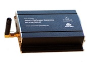

# E-Kit EnOcean IoT ゲートウェイ 取扱説明書

株式会社デバイスドライバーズ 
2020年6月15日　第2版 
配布元 ★★★★★

## はじめに
このたびは、E-Kit EnOcean ゲートウェイをご購入頂きまして、ありがとうございます。
ご使用前に次項の「安全上のご注意」に気を付けて、安全にお使いください。

### 安全上のご注意
本機器は、電波法に準拠したEnOcean 省電力無線通信技術に基づいた製品です。電源（ACアダプター）部分の誤った使い方をした場合には、事故が発生する場合もあるので、次の通り十分気を付けてご利用ください。
- 異様なにおいや音がするなど、異常があった場合はすぐにACアダプターを抜いて電源を切ってください。
- 本装置に接続するACアダプターは、PSEマーク付きの製品添付のものだけを使用してください。
- ACアダプターの本体、コードやプラグを改造して使用しないでください。
- ACアダプターは100V～240V, 50～60Hz, 0.3Aの定格です。定格外の電源に接続しないでください。
- USBとLAN用のコネクターには、規格外の機器を接続しないでください。

### 製品概要
E-Kit EnOcean ゲートウェイは、EnOcean 無線通信プロトコルに準拠した各種のEnOcean センサーから送信される信号を受信して、TCP/IP に変換して出力する機器です。

E-Kit EnOcean ゲートウェイは、EnOcean 無線通信プロトコルに準拠した各種のEnOcean センサーから送信される信号を受信して、TCP/IP に変換して出力する機器です。E-Kit EnOcean ゲートウェイでは、[ドイツ Digital Concepts社開発の Smart EnOcean Gateway](http://enocean-gateway.eu/en/product/)  をベースに、オープンソースの独自ソフトウェアを搭載することで、拡張性が高く使い易い機能を実現しています。次の特長を持ちます。

- Web UI
	全ての機能をブラウザから操作可能な、使い易いWEB ユーザーインターフェースを備えます。

- EnOcean Profile 
	EPとGPのTeach-In テレグラムに対応し、LEARN ボタンにより EP/GP の EnOcean Profile を各デバイス固有の ID とともに登録、管理します。

- 各種サービス
	iBRESS ETK, Microsoft Azure, OPC UA (Industry 4.0 推奨プロトコル) の各サービスに対応済で、すぐに利用できます。対応サービスは今後さらに拡充予定です。

- モニター
	EnOcean テレグラム・モニター 機能を備え、運用中の電波状況を確認できます。

- ログ
	本体操作、EnOcean テレグラム受信、各種サービスのログ管理と表示機能を持ちます。

- ファームウェア更新
	ファームウェア更新により、最新機能や個別対応機能を利用できます。

なお本システムソフトウェアと本説明書は、不具合の解消や新機能の追加に伴って、予告なくバージョンアップ（内容を更新）する場合があります。また更新の有無に関わらず、説明画面や説明内容が、多少実際とは異なる場合がありますが、ご了承をお願いします。問題点のご報告やご要望は「e-kit@devdrv.co.jp」宛に、メールでご連絡をお願いします。

### 機能

本製品の機能を「基本機能」と各サービスに固有の「拡張機能」に分けて、より詳細に説明します。

#### 基本機能

本製品の基本的な機能です。

- 専用ケース

    付属金具等などにより様々な場所に設置可能な、取り付け穴付きの頑丈な専用アルミニウムケースを採用しています。トルクスネジ採用で、容易に開けられない構造となっています。

- 日本国内向け専用EnOcean 無線通信

    総務省の認可を受けた928.35MHz / FSKのEnOcean無線通信の受信をサポートしています。専用アンテナにより電波受信感度を増強しています。

- EnOcean Profile とIDフィルター

    EEP (Enocean Equipment Profile) と GP (Generic Profile)  によるセンサーの識別と、登録済センサーのIDフィルター機能をサポートしています。

- Web UI

    PC やスマートフォン等のブラウザから専用の Web インターフェースページにアクセスして、各種設定・操作と機器管理が可能です。

- uPnPによるゲートウェイ発見

    uPnP を搭載しているため、DHCP使用時でも容易に本装置のIPアドレスを発見して、操作用のホームページにアクセスが可能です。 

- ファームウェア更新

    Web UIにアクセスして、ファームウェア更新を行うことが可能です。

#### 拡張機能
E-Kit EnOcean Gateway では次の各種サービスへの接続を拡張機能としてサポートしています。これらの拡張機能は今後、拡充、更新される場合があります。

- Skkynet ETK

    カナダSkkynet Cloud Systems, Inc.社の組込みシステム開発用データ転送技術「ETK」を搭載して、iBRESS Cloud / Cogent Datahub 等への接続をサポートしています。

- OPC UA サーバー

    Open62541のサーバー側を移植搭載して、OPC UA サーバー機能を実装しています。

- Azure IoT Hub

    Microsoft Azure IoT Hub へのデータ転送と IoT Hub Device ID の自動更新機能をサポートします。

## 起動とネットワーク接続

本装置は、TCP/IP有線LAN回線に接続することで、EnOcean無線データを転送することが可能です。

アンテナを装着し、Ethernetコネクターをインターネット接続可能な回線に接続してから、ネットアンテナ側の「5V DC」コネクターに、製品添付のACアダプターを差し込んで電源を投入します。**電源スイッチはありません。LED点灯後約30秒程度で利用可能になります。**

### 2.1 IPアドレス
E-Kit EnOcean Gatewayは次の2種類のIPアドレスを持っています。本装置ではIPV4アドレスだけを扱い、IPV6アドレスは使用しません。

- 通常運用IPアドレス

    通用運用時のIPアドレスは、「システム設定ページ」の設定により、DHCP（デフォルト）と固定IPアドレスを選択して設定可能です。

- 緊急IPアドレス

    192.168.249.249 (サブネット マスク255.255.255.0＝24ビット) の固定IPアドレスを持っています。トラブル発生時、または緊急時に接続するためのアドレスなので変更できません。

以降はWebブラウザからE-Kit EnOcean Gatewayに接続するための手順について説明します。

- DHCPが利用可能な場合

接続するネットワーク環境でDHCPを用意している場合は、E-Kit EnOcean Gatewayをネットワークに接続するための設定は必要ありません。次項の「ゲートウェイのIPアドレス探索」の説明に従ってゲートウェイのアドレスを発見後、Webページにアクセスしてください。

- DHCPが利用できない場合

接続するネットワーク環境でDHCPが利用できない場合、固定IPアドレスで使用します。ブラウザから緊急用固定IPアドレスに接続後、ゲートウェイのアドレスを目的の固定IPアドレスに設定変更してから、Webページにアクセスします。詳細手順は ★★項の「補足説明」を参照してください。

### ゲートウェイのIPアドレス探索

ブラウザで E-Kit EnOcean Gateway にアクセスする場合、接続先のアドレスを指定する必要があります。

なおDHCPを使用せず、固定IPを設定している場合でも、同様の手順でゲートウェイのIPアドレスを確認することが可能です。
 
#### 探索手順
uPnPに対応したWindows搭載PCを使用した、IPアドレスの探索手順を示します。探索する場合は、最初にWindows PCをE-Kit EnOcean Gatewayと同じサブネットのネットワークに接続して、次の方法で確認します。
- コンピューターの「ネットワーク」を開きます。

- 画面中央部にある「ネットワークインフラストラクチャ」のカテゴリにある「Linux Internet Gateway Device」のアイコンを開きます。このアイコンが表示されるには、ゲートウェイの電源投入後約30秒程度かかります。

画面　「ネットワークの表示」

- 開いたプロパティ画面の一番下に表示されたIPアドレスが接続先のゲートウェイのIPアドレスなので、ブラウザの接続先にコピーして接続します。

画面　ネットワークデバイス

## ゲートウェイ コントローラー
E-Kit EnOcean Gatewayは、Webブラウザを使用して「ゲートウェイ コントロール」と呼ぶ、ゲートウェイが用意するホームページにアクセスして操作します。
この章では、ゲートウェイ コントローラーを使用して操作できる機能を解説します。

### 3.1.	基本操作
ログイン、ログアウトとシャットダウンなどの基本的な操作を説明します。

#### 3.1.1.	ログイン
初めてコントロールページにアクセスする場合は、ログイン画面が表示されるので、Usernameに「admin」、Passwordに「admin」を入力後「Login」をクリックして接続します。

ログイン状態は、ログアウトするかブラウザを閉じるまでの間、継続します。UsernameとPasswordはログイン後に設定可能となる「システム設定」ページで変更することができます。

画面　Gateway ログイン

#### コントロールページ
ログインに成功すると、次の様なメイン操作画面の「コントロールページ」が表示されます。E-Kit EnOcean Gatewayの基本操作はこのページで行います。
コントロールページの各項目の役割を説明します。

画面　コントロールページ

#### シャットダウンと再起動
コントロールページの「システム」グループのラジオボタンを選択して「停止」または「再起動」を設定後、「実行」ボタンのクリックでシステム全体がシャットダウン、または再起動します。シャットダウン後もアンテナ横の青色LEDは点灯したままです。電源が切れたかどうかは、LANケーブルコネクタのLEDが消灯したことで判断します。電源ボタンはありません。電源断後の再起動時は、ACアダプターのケーブルを抜き差ししてください。

画面　シャットダウン、再起動とログアウト

#### ログアウト
コントローラーページの「ログアウト」リンクをクリックすることで、すぐにログアウトしてログイン画面に遷移します。
ログアウトしても、各種ゲートウェイ機能は動作したままです。

### EnOcean 設定
E-Kit EnOcean Gatewayは、次のEnOcean動作モードに対応した、EnOceanセンサーの受信機能を提供します。
EnOcean受信動作モードの設定は、「EnOcean動作モード」ラジオボタン選択後、「動作モード」のラジオボタンを選択して、「実行」ボタンをクリックして確定します。

画面　EnOcean 動作モード設定

①	モニター
センサー登録の有無に関わらず、すべてのセンサーからのデータを受信して状況を表示します。ゲートウェイ機能としてのデータの転送は行いません。
Version 1.2 以降のシステムソフトウェアで対応予定です。

②	新規登録
このモードで動作中は、現在の全センサーの登録情報を破棄して、センサーのLEARNボタン押下による「Teach In」テレグラムを受信して、テレグラム フィルターに追加登録を行います。

③	追加登録
各センサーのLEARNボタン押下による「Teach In」テレグラムを受信して、テレグラム フィルターに追加登録を行います。RPSテレグラムを使用するロッカースイッチにはLEARNボタンが無いため、いずれかのボタン動作で登録が完了します。

④	運用
センサーやスイッチからのデータを受信してゲートウェイ転送する、通常運用時の動作モードです。電源投入後はこのモードで動作しています。

#### 3.2.1.	登録済デバイスの表示
E-Kit EnOcean Gatewayに登録されたEnOceanデバイス（各種センサーとスイッチ類）は登録済デバイスとして、コントローラーページに次の様に表示されます。「Point-1～Point-6」は各デバイスが持っているデータ出力ポイント名です。各センサーは複数のデータ出力ポイントを持つ場合があります。このポイント名とドメイン名を組合せた値が、ゲートウェイ転送時のポイント名（データノード名、デバイスID）として使用されます。

データ出力ポイント名は、登録時に自動的に割り付けられます。「Point-1～」の各ポイント名が示すデータの意味は、参考資料②の「EnOcean EEP」で該当するEEPの項を調べて下さい。
EEP定義の「Shortcut Name」をポイント名としてそのまま使用し、重なった場合には「1～99」の数字を末尾に追加して割り当てます。従って登録可能なデバイスの最大数は、登録するデバイスEEPが持つ「Shortcut Name」数に依存します。3CH Current Culampだけを接続する場合は最大33台、様々なセンサー混在を登録する場合は、100台程度が登録可能です。最大数に達したかどうかは、この登録済デバイス表示画面で確認してください。

■■画面　登録済デバイス表示

#### 3.2.2.	センサーの新規登録
「新規登録」モードを実行すると、既存のセンサー登録設定を削除して、新規センサーの登録を開始します。このモードで動作中に登録するセンサーの「LEARN」ボタンを押して、センサーを登録してください。
「運用」モードに切り替えることで、「登録」モードを終了します。
**この「新規登録」モードの実行により、確認無しで登録済の全センサーの情報が削除されます。**ご注意ください。

#### 3.2.3.	センサーの追加登録
「追加登録」モードを実行すると、センサーの追加登録を開始します。このモードで動作中に登録するセンサーの「LEARN」ボタンを押して、センサーを登録してください。「運用」モードに切り替えることで、「登録」モードを終了します。

#### 3.2.4.	運用
登録済センサーのデータを受信します。ゲートウェイ起動時はこのモードで動作しています。

登録済のセンサーからのデータだけを受信して、ゲートウェイ機能としてETK、あるいはOPC UAサーバーとすてデータ転送します。データ受信は、EnOcean無線通信でのテレグラム フィルター機能を使用して行うため、EnOcean通信機器が多い環境でも受信データのバッファーオーバーフローによるデータの取りこぼしがありません。

### 3.3.	ETK 設定
①	iBRESS ETK接続
ラジオボタンの「iBRESS ETK」選択後、iBRESS ETK設定項目（Host, Data Domain, User Name, Password）を入力して、「設定」ボタンをクリックします。3秒程度でETKが新しく設定したパラメーターに従って再起動します。ゲートウェイの起動時は最後に設定した内容に従ってETKが自動起動します。以下に入力例を示します。

■■画面　iBRESS ETK設定

**なお設定内容が間違っている場合、あるいは設定完了時に接続先のiBRESSサーバーに接続できない場合は、ETKが起動しないので、注意してください。**

②	DataHub ローカル接続
iBRESS ETKの設定で「User name」「Password」を入力しない場合は、SSHとWebSocketを使用しない、DataHubへの接続モードで動作します。DataHubにローカル接続する場合はこの設定を使用します。以下にこの場合の設定例を示します。

■■画面　ローカルDataHub 接続設定

### 3.4.	OPC UA 設定
機能選択ラジオボタンの「OPC UA」をクリックして、OPC UAサーバーの設定を行います。設定はサーバーのPort番号とデータDomain名だけです。「実行」ボタンをクリックして設定が完了し、OPC UAサーバーが再起動します。
この設定した内容は保存され、ゲートウェイの再起動時には設定した内容で、自動的にOPC UAサーバーを開始します。

■■画面　OPC UAサーバー設定

### 3.5.	システム 設定
コントローラーページの「システム設定」のリンクをクリックすると、次の様な「システム設定」ページに移動します。以下にシステム設定ページの各設定項目を示します。

■■画面　システム設定ページ

システム設定ページでは次の機能をサポートしています。
①	IPアドレス確認と設定
②	ユーザー設定
③	バージョン情報確認
またこのページには、ファームウェア更新ページへの移行リンクがあります。
各項目の設定について説明します。

3.5.1.	IPアドレス設定
E-Kit EnOcean GatewayのIPアドレスを「自動（DHCP）」または「手動設定（固定IPアドレス）」のいずれかに設定します。手動設定の場合はさらに「IPアドレス」、「Net Mask」、「IP Gateway」、「DNS」、「ドメイン名」の設定を次の通り行います。各設定内容はすぐには設定されず、再起動後に有効になります。

①	IPアドレス
IPV4アドレスを設定します。

②	Net Mask
サブネット マスク(Subnet Mask)をマスクの上位ビット数または、「255.255.255.0」の様なIPアドレス形式で設定します。現在の設定状況はマスクの上位ビット数（「255.255.255.0」の場合は「24」など）を表示します。

③	IP Gateway
インターネットに接続するためのゲートウェイのIPアドレスを設定します。

④	DNS1
接続先の名前解決で使用する1台目のDNSのIPアドレスを設定します。

⑤	DNS2
接続先の名前解決で使用する2台目のDNSのIPアドレスを設定します。DNSはDNS1またはDNS2のいずれか、あるいは両方を設定してください。

⑥	ドメイン名
ローカルネット接続で使用するドメイン名を設定します。

次の画面で設定例を示します。IPアドレス設定時は設定項目ラジオボタンで「IPアドレス」を選択し、IPアドレスの種別を「自動（DHCP）」または「手動設定」のどちらかを選択します。「手動設定」時は各設定項目を入力します。この例ではNet Maskを「255.255.255.240」として設定していますが、上位28ビットをマスクするので「28」と入力しても同じです。
入力設定後は「設定」ボタンをクリック後、再起動してください。

■■画面　IPアドレス設定

3.5.2.	ユーザー設定
E-Kit EnOcean Gatewayにログインするユーザー名、またはパスワードを変更する場合に設定します。ログイン用ユーザーは1種類だけが登録可能です。
パスワードを忘れてしまった場合に復帰する方法はないので、設定を変更する場合には、十分気を付けて運用してください。

①	ユーザー名
新しいユーザー名を入力して設定します。

②	パスワード
新しいパスワードを入力して設定します。変更しない場合でも必ず入力してください。

③	確認入力
パスワードの確認入力です。前項に入力したのと同じパスワードを再度入力してください。

次の画面でユーザー名の設定例を示します。ラジオボタンで「ユーザー名」を選択し、新たに設定する「ユーザー名」「パスワード」「確認入力」を入力後、「設定」ボタンをクリックします。
ユーザーの設定変更は、その場ですぐに実行されるので、設定後は新しいユーザー設定で再度ログインする必要があります。

 
■■画面　ユーザー設定

3.6.	ファームウェア更新
E-Kit EnOcean Gateway搭載のシステムソフトウェア（ファームウェア）は、不具合の解消や新機能の追加のため、バージョンアップする場合があります。更新用ファームウェアはDDP拡張子を持つ特殊な形式の圧縮ファイルで、ホームページまたはメールなどで配布します。

新しいファームウェアへの更新作業は、「システム設定ページ」の「ファームウェア更新」リンクをクリックして表示される「ファームウェア更新ページ」で行います。以降に、更新手順を示します。
 
■■画面　ファームウェア更新リンク

①	ファームウェア更新ページ
次のファームウェア更新ページに移動するので、「参照」をクリックして入手したファームウェアを選択するファイルダイアログを開きます。
 
■■画面　ファームウェア更新ページ
 
②	アップロードするファイルの選択
次の「アップロードするファイルの選択」ダイアログが開くので、ファイラーを操作して入力した更新用ファームウェアファイルを選択し「開く」をクリックします。
下記画面の例は「C:\TEMP\ekitgw-000000.ddp」というファイルを選択しています。

 
■■画面　ファイルの選択ダイアログ

③	アップロード送信
更新メニューに選択したファイル名が表示されるので確認して、「送信」ボタンをクリックしてアップロード転送します。
 
■■画面　ユーザー設定

 
④	更新完了
通常は１～2秒程度で更新が完了するので、「確認」ボタンをクリックして「コントローラーページ」に移動し、再起動して下さい。
 
■■画面　更新完了

## より詳細な機能

## サポートと保証
本製品は、日本国内の屋内の一般的な利用環境で使用された場合には、不具合発生時にご購入後1年間の無償修理による保証を行います。保証期間内であっても、規定外の利用や改造による故障、火災・地震や台風等の天災が原因の場合は、無償保証の対応外とさせて頂きます。

不具合でお困りの場合、あるいは保証に関して不明な点はご購入先、または株式会社デバイスドライバーズ E-Kit事業部「e-kit@devdrv.co.jp」宛にメールでお問い合わせください。

株式会社デバイスドライバーズ
E-Kit事業部
© 2018 Device Drivers, Ltd.

